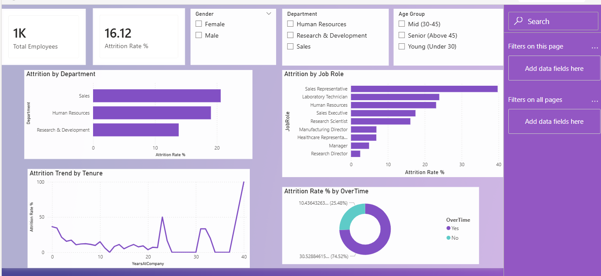

# HR-Analytics-Attrition-Analysis
End-to-end HR analytics project using Python, SQL and Power BI to analyze employee attrition

## Project Overview
Analyzed IBM HR Analytics dataset of 1,470 employees to identify 
key drivers of employee attrition using Python, SQL, and Power BI.

## Problem Statement
The company is experiencing high employee turnover. This project 
identifies why employees are leaving and provides data-driven 
recommendations to improve retention.

## Tools Used
- Python (Pandas, Matplotlib, Seaborn) — Data cleaning and EDA
- SQL (SQLite) — Business queries and KPI extraction  
- Power BI — Interactive dashboard

## Key Findings
1. Overall attrition rate is 16.1% — above industry average
2. Sales department has the highest attrition at 20.6%
3. Employees earning below $3,000/month leave at 2x the rate
4. Overtime workers are 3x more likely to leave
5. Most attrition happens in the first 2 years of employment

## Recommendations
1. Review compensation for Sales and entry-level roles
2. Introduce overtime compensation policy
3. Strengthen onboarding program for new joiners
4. Conduct quarterly satisfaction surveys in high-risk departments

## Dashboard Preview

## Project Structure
- hr_analysis.ipynb — Python notebook with cleaning, EDA and SQL
- hr_queries.sql — Raw SQL queries
- hr_cleaned.csv — Cleaned dataset
- dashboard_preview.png — Power BI dashboard screenshot
